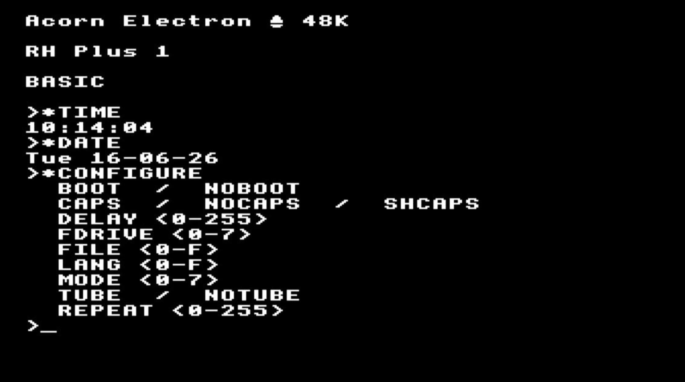

I2CBeeb ROM for BBC, Electron, Electron AP6
===========================================

> **⚠️ IMPORTANT NOTE:** This is a development branch. Source files relating to other AP6 supporting ROMs and builds of them will not be merged into the final branch—they are temporarily stored here for ease of development.

This project started as a way to explore and implement RTC commands (`*TIME`, `*DATE`, etc.) for the Electron **AP6** by Dave Hitchens (see StarDot [thread](https://stardot.org.uk/forums/viewtopic.php?t=28720)). A further wish of Dave's was to bring `*CONFIGURE`, `*STATUS`, `*INSERT`, and `*UNPLUG` functionality to the Electron AP6 — which this project also now enables.

Along the way this repo has grown into a set of tools for building and testing the **I2CBeeb ROM** by MartinB (of StarDot, [thread](https://stardot.org.uk/forums/viewtopic.php?t=10966)) with the BeebAsm assembler, targeting the **BBC Micro**, **Electron**, and **Electron Plus with AP6**. It can also rebuild the AP6 Support ROM to include the I2C AP6 ROM, albeit without TreeROM due to size restrictions.

Many thanks also to **JGH** (J.G.Harston), who has supported the project with code changes and reviews of the **Electron ROM Manager** and **Plus 1 Support ROM** needed to integrate with the `*CONFIGURE`, `*STATUS`, and NVRAM storage features the I2CBeeb ROM exposes for Electron AP6 users.

Where did the Source code come from?
------------------------------------

MartinB the author of the **I2C Beeb ROM** [shared his code](https://stardot.org.uk/forums/viewtopic.php?p=419276#p419276) in order to help create a compatible version for the Acorn Electron AP6. Rather than forking his code just for AP6, the aim was to explore whether AP6 support could be added while still supporting future updates.

This was quite easy as Martin had done an amazing job at separating out the code needed to access the I2C bus and read/write to the RTC from all the other logic. Using the `INCLUDE` directive it is possible to have a single source file for the bulk of the code, with the differences needed to support each target kept separately. The build now uses **BeebAsm** rather than the original Lancs Compiler, but the same `INCLUDE` approach still applies, so should the main code be updated all three targets can easily be rebuilt from it, much like how the variants of **MMFS** work.

Martin has given [kind permission](https://stardot.org.uk/forums/viewtopic.php?p=426768#p426768) to leverage his code to make all this possible and hopefully making iterating on the ROM for all targets possible in the future. Since then as noted above the `/src` now contains a migration of his original code that now supports the BeebAsm tool, which speeds up the compilation dramatically and removes the need for an emulator.

For the Electron **AP6** builds of the I2CBeeb ROM, this repository has also partnered with Barney Hilken, the author of the [Time & Config. ROM](https://codeberg.org/Barneyntd/Time-Config.), to reuse its configuration feature implementation — many thanks to Barney for making this integration possible. I2CBeeb reuses only the `*CONFIGURE` and `*STATUS` commands for machine configuration, together with the related reset and apply logic. In integrating parts of Barney's code, the storage layer was substituted to use the **PCF8583** RTC's free RAM over the AP6 I2C bus, whereas his original implementation stores settings in an **FRAM** module accessed via the VIA.

The `*INSERT` and `*UNPLUG` commands are **not** reused from Time & Config — they are existing commands in the AP6 **ROM Manager**, and become NVRAM-aware (persisting across power cycles) via I2CBeeb when both are present (e.g. embedded together in the AP6 Support ROM). For more information on Time & Config ROM features, refer to the [Time & Config. repository](https://codeberg.org/Barneyntd/Time-Config.) directly.

Supported Platforms and Features
--------------------------------

The project builds multiple ROM variants for each target platform:

| Filename (/dist) | Filename (.ssd) | Platform | RTC Type | I2C Core | *CONFIGURE \*\* | AP6 Support ROMs | I2C Testing |
|------------------|-----------------|----------|----------|----------|------------------|-----------------------|-----------|
| `i2cb.rom` | `I2CB` | BBC Micro* | DS3231 | ✓ | | | |
| `i2cbt.rom` | `T.I2CB` | BBC Micro* | DS3231 | ✓ | | | ✓ |
| `i2ce.rom` | `I2CE` | Electron | DS3231 | ✓ | | | |
| `i2cet.rom` | `T.I2CE` | Electron | DS3231 | ✓ | | | ✓ |
| `i2ceap6.rom` | `I2CEAP6` | Electron AP6 | PCF8583 | ✓ | | | |
| `i2ceap6c.rom` | `C.I2CEAP6` | Electron AP6 | PCF8583 | ✓ | ✓ | | |
| `i2ceap6t.rom` | `T.I2CEAP6` | Electron AP6 | PCF8583 | ✓ | ✓ | | ✓ |
| `ap6.rom` | `AP6` | Electron AP6 | PCF8583 | ✓ | ✓ | ✓ | |

**\*** — the `I2CB` / `T.I2CB` rows are one sideways-ROM profile for **BBC Model B**, **B+**, **Master**, and **Master Compact** (not separate Master builds). The I²C core (`*I2C…`, RTC/time commands, `*I2CTEST`) is expected to work on all of them; bus access is via the **user port**, the same attachment path on Model B and Master-class machines.

**\*\*** — `*CONFIGURE`, `*STATUS`, and related Time-Config features appear only in **Electron AP6** builds (tick in that column). They require **NVRAM**; the AP6 **PCF8583** has free RAM for persisted settings. Among the AP6 standalone ROMs only **`i2ceap6c.rom`** (`C.I2CEAP6`) includes these commands — the plain **`i2ceap6.rom`** is config-less. Typical **DS3231** modules on **Model B, B+**, and basic **Electron** have **no user-accessible RAM**. **Master** machines already provide their own persisted configuration—so those commands are omitted from all BBC-family ROMs by design. Detected **EEPROM** devices on the I²C bus could provide NVRAM on other targets in future.

This project also includes support for building the AP6 Support ROM (`ap6.rom`) which combines the I2C ROM with other AP6 ROMs (AP1Plus, ROMManager, TUBEelk, AP6Count) into a single 16KB ROM image. The build process is handled by [`/bin/buildap6/build.sh`](bin/buildap6/build.sh) and uses SMJoin compatibility to enable ROM relocation and chaining. For detailed technical information about the AP6 Support ROM build process, see the [SMJoin Compatibility Implementation](DIARY.md#smjoin-compatibility-implementation-sept-2025) section in the developer diary.

Important Distribution Note
---------------------------

This repository `/dist` folder contains version **v3.2** and above of the **I2CBeeb** ROM. If you need the official I2CBeeb ROMs **v3.1**, see [thread](https://stardot.org.uk/forums/viewtopic.php?t=10966) for other variants. Looking forward, since this repo supports building all variants of the ROM, one option is this repository may become the main I2CBeeb repository in the future, or it may reside some other place. Currently the source code is only shared by Martin as attachments on StarDot and in this repository per his kind permission.

Time & Config sources are copied under [`src/configure/`](src/configure/) for now with AP6-specific edits applied in-tree. The goal is to dynamically import only the required code once the integration work has completed and the touch points are clearer. For more information and documentation on Time & Config ROM features, readers should refer to the [Time & Config. repository](https://codeberg.org/Barneyntd/Time-Config.) directly.

I2C Devices Supported
---------------------

BBC Micro and Electron builds talk to a **DS3231** at **`&68`** (`RTC` in `src/inc/rtc/DS3231.asm`). Electron **AP6** builds (and production AP-class boards with the on-board RTC) use a **PCF8583** at **`&50`** (`RTC` in `src/inc/rtc/PCF8583.asm`) — the same address used in the `*I2CRXB 50 …` examples in [Usage with Electron AP6 Platform](#usage-with-electron-ap6-platform) below.

The I²C bus commands (`*I2CRXB`, `*I2CTXB`, `*I2CQUERY`, etc.) take the device address in **decimal** (`50` = `&50`). On AP6, **`&50` registers `10h`–`11h`** are reserved by the RTC layer (year offset, year copy, `*TBRK`); **configure NVRAM uses logical addresses `0`–`17`** (chip `12h`–`23h`: settings **0–16**, init marker at logical **17** = chip **`23h`**). Logical **238+** wraps into the clock region — do not use. Other devices on the AP6 header must not clash with **`&50`**. Use `*I2CQUERY` / `*I2CTEST` on hardware to confirm.

Developer Diary
---------------

Development status and milestones (newest first) are tracked in a separate developer diary to keep this README focused on usage and reference. See [DIARY.md](DIARY.md) for the full history, including the in-progress v3.3 work, the BeebAsm migration, and earlier releases.

Usage with Electron AP6 Platform
--------------------------------

You need a Plus 1 with the AP6 expansion board fitted and a battery installed for the RTC chip to retain time and data. Download and install/load the ROM above. The `I2CEAP6*` ROMs are standalone; for the `*CONFIGURE`/`*STATUS` NVRAM features use **`i2ceap6c.rom`** (the plain `i2ceap6.rom` is config-less). Note that this NVRAM storage will only work if the I2C ROM is installed in a **higher ROM slot than the AP6 Support ROM**, and that AP6 Support ROM must be **v1.341 or above**. Alternatively the AP6 Support ROM can be replaced (at the reader's own risk) with the combined `ap6.rom`, which bundles the I2CBeeb ROM within it — see [Supported Platforms and Features](#supported-platforms-and-features).

All the commands, `*TSET, *DSET, *NOW, *DATE, *TIME` etc work as per documentation on Martins [thread](https://stardot.org.uk/forums/viewtopic.php?t=10966). There is one notable exception that the `*TEMP` command outputs `Not Available`, because the PCF8583 RTC does not support this. The `*CONFIGURE` and `*STATUS` commands work as per the [Time & Config. repository](https://codeberg.org/Barneyntd/Time-Config.). The `*ROMS`, `*UNPLUG` and `*INSERT` commands from the ROM Manager (included in the AP6 Support ROM) will now retain their state over a power cycle in this configuration.

As an additional feature, the PCF8583's spare RAM can be used to store your own data and have it retained across power cycles. The ROM reserves chip registers **`10h`** (year offset) and **`11h`** (year copy and `*TBRK` toggle). **Configure NVRAM** uses logical bytes **0–17** (chip **`12h`–`23h`**: settings **0–16**, initialised marker at logical **17** = chip **`23h`**). Spare logical addresses **18–237** map to chip **`24h`–`FFh`**. Do not use `*I2CTXB`/`I2CRXB` on chip regs below **`12h`** except for RTC debugging. Note that **`50`** in the commands below is the device ID for the installed PCF8583.

    *I2CQUERY
    *I2CRXB 50 #12 A%
    *I2CRXB 50 #02 A%
    *I2CTXB 50 #12 66

    $&A00="HELLO"
    *I2CTXD 50 #12 06
    *I2CRXD 50 #12 06
    P.$&A00

Finally, note that the AP6, has I2C headers on board, meaning you can attach easily other I2C devices and access them using the above commands. Please be careful attaching new devices and observe the correct pin out, then run `*I2CQUERY`.

### Factory Reset

Persisted settings set by `*CONFIGURE` live in PCF8583 NVRAM and are applied to MOS on every boot (Ctrl+Break or power-on). The following triggers determine whether NVRAM is reset, initialised, or simply applied:

| Trigger | What happens |
|---------|----------------|
| **Hold `R` during break** | Factory reset — default `*CONFIGURE` values are written. Does not reset the RTC chip. |
| **Uninitialised NVRAM** | Automatic factory reset on first boot of new or blank NVRAM, then marked initialised so later breaks do not re-init. |
| **Normal break** | Apply saved settings from NVRAM; no full reset. |

Building
--------

Build with `./bin/build.sh` and this will compile using BeebAsm all three targets for BBC Micro, Acorn Electron and Acorn Electron Plus 1 AP6 in `/dist`. It will also update `/dev/eap6` and `/dev/roms`; these folders work with virtual file systems such as the one in b-em and are supported by UPURSFS, so build output can be loaded and tested on a target machine. The `dev/eap6` folder also receives dev utilities from the AP6 build SSD: `COLD` (6502 executable from `COLD.asm`) and tokenised BASIC files `NVList`, `RTCTest`, and `RTCRead` (via `PUTBASIC`). See [COLD Utility](#cold-utility).

Unless you pass `--skip-testing`, the build also runs the automated ROM unit tests described below.

COLD Utility
------------

Testing `*CONFIGURE LANG` (and other NVRAM settings applied on boot) needs a **true power-on** (`&028D = 1`). Ctrl+Break and `JMP (&FFFC)` do not reload configure from NVRAM—they are soft or hard breaks, not cold start. The **`COLD`** utility fakes a power-on reset in software so you can repeat configure tests without mains off/on. It uses [JGH’s `.ResetElk`](https://stardot.org.uk/forums/viewtopic.php?t=20240) routine. Example usage:

    *CONFIGURE LANG 5
    *STATUS LANG
    *COLD

After reboot, check power-on path and session LANG:

    PRINT ~?&028D    : REM expect 1 (power-on)
    PRINT ~?&0D6D    : REM LANG in low nibble after GetTubeAndLang

ROM workspace
-------------

Fixed RAM the ROM uses for storage (see [`src/I2CBeeb.asm`](src/I2CBeeb.asm)). MOS star-command scratch at `&A8–&AF` may be overwritten during any `*` command; do not rely on it across `OSCLI`. The ROM does not use `&0234–&0235` (`INDV3`).

| Range | Role |
|-------|------|
| `&A8–&AF` | Star-command scratch — parser temps, command table pointer, I²C flags during `*` handlers |
| `&02E0–&02EA` | I²C transaction state (device address, register, byte count, status, EEPROM helpers) |
| `&0380–&0392` | RTC time/date scratch (`buf00`–`buf06`, `buf12` ToB, temp bytes on DS3231) |
| `&0A00–&0AFF` | I²C Tx/Rx buffer and `*NOW$` output |
| `&E4–&E5` | Configure builds only — Time-Config string pointer (`STR_PrintString`) |

Persistent settings on AP6 are stored in **NVRAM on the board** (PCF8583/FRAM), not in these RAM areas.

ROM unit testing
----------------

Each `./bin/build.sh` run (unless `--skip-testing` is passed) exercises the **real assembled ROM binaries** against a simulated 6502, with MOS calls stubbed out so tests can run quickly on a modern machine without a Beeb attached. This is separate from the on-machine `*I2CTEST` command documented [further down](#rom-device-testing)—those tests need hardware and an I2C bus.

In general they cover sideways-ROM good manners—correct `*` command dispatch via the service entry, respecting MOS zero-page workspace, Acorn-style `*HELP` output, and sensible time/date, `*TBRK`, and (on AP6 configure builds) `*CONFIGURE`/`*STATUS` NVRAM behaviour against a mocked RTC. They run against the main ROM variants in `/dist` (BBC, Electron, and Electron AP6) and validate ROM logic and MOS integration, **not** real I2C electrical behaviour—that remains the job of `*I2CTEST` on real hardware. Where the tests live:

| Location | Purpose |
|----------|---------|
| [`src/tests/vitest/`](src/tests/vitest/) | Test cases for standalone and configure builds, plus ROM fixtures (see **`src/tests/vitest/README.md`**) |
| [`bin/rom-unittest/`](bin/rom-unittest/) | Test harness, MOS/RTC/NVRAM mocks, workspace guards |

To run the unit tests on their own after a build:

    cd bin/rom-unittest && npm test

When `./bin/build.sh` runs, the unit tests are exercised against several ROM targets. First the standalone ROM variants (BBC, Electron, and Electron AP6) are tested directly. The AP6 Support ROM build then produces a composite image (`dist/ap6.rom`) which is tested in its combined layout, along with an `ap6-classic` ROM built purely as a test fixture (not shipped in `dist/`). The `ap6-classic` fixture exercises the (modified) **ROM Manager** and **Plus 1 Support ROM** *without* I2CBeeb present, so we can verify the code paths in them that behave dynamically depending on whether I2CBeeb's NVRAM implementation is available—confirming correct LANG/TUBE behaviour both with and without it. This way each shipped and fixture target is validated in the form it will actually run. See **`bin/rom-unittest/README.md`** for the full breakdown.

ROM device testing
------------------

The I2C ROM includes a comprehensive test framework accessible via the `*I2CTEST` command.

This framework provides automated testing of I2C bus functionality, low-level I2C operations, and RTC (Real-Time Clock) operations. The test framework runs a series of tests and reports results, showing "Pass" or "Fail" for each test with step numbers for detailed failure reporting. **All tests require actual hardware and cannot be run in emulation** - some tests focus on low-level I2C bus operations, while others require an RTC device (DS3231 or PCF8583) connected to the I2C bus.

**Important:** The `*I2CTEST` command is only available in the test builds of the ROMs. Production ROMs exclude this command to conserve space. Test ROMs are available both as individual ROM files in `/dist` (e.g., `i2cbt.rom`, `i2ce.rom`, `i2ceap6t.rom`) and on the SSD disc image `i2c.ssd` in DFS format (e.g., `T.I2CB`, `T.I2CE`, `T.I2CEAP6`).

To run the tests, simply load a test ROM and execute:

    *I2CTEST

The test framework will run all registered tests and display results for each one.

**Test Suite:**

| Test | What It Tests |
|------|---------------|
| 01. Bus Idle State | Verifies I2C bus is in idle state (SDA high) |
| 02. START Condition | Verifies START condition sets SDA low |
| 03. STOP Condition | Verifies STOP condition returns SDA to idle (high) |
| 04. SCL Control | Verifies SCL line control (indirectly via clock pulse) |
| 05. SDA Control | Verifies SDA line can be set high and low |
| 06. Clock Pulse | Verifies clock pulse generation (sclhi then scllo) |
| 07. START-STOP Sequence | Verifies complete START-STOP sequence |
| 08. Address Transmission | Verifies 7-bit address transmission with ACK/NACK handling |
| 09. Write and Read Byte | Verifies byte write and read operations to RTC |
| 20. Time Set and Read | Verifies time values can be written and read from RTC |
| 21. Date Set and Read | Verifies date values can be written and read from RTC |
| 22. Time Passage (3 seconds) | Verifies RTC time advances correctly over time |

Known Issues
------------
- None at present

Other (Useful) Stuff
--------------------

Various reference resources, forum posts etc..
- [Read RTC Clock - OSWORD 14](https://beebwiki.mdfs.net/OSWORD_%260E)
- [Write RTC Clock - OSWORD 15](https://beebwiki.mdfs.net/OSWORD_%260F)
- [Real time clock upgrade for Electron](https://www.stardot.org.uk/forums/viewtopic.php?p=419371&hilit=RTC#p419371)
- [OSWORD 14 & 15 numbers for real-time clocks](https://www.stardot.org.uk/forums/viewtopic.php?t=28743)
- [Userport RTC](https://stardot.org.uk/forums/viewtopic.php?f=3&t=26270)
- [Setting a real-time clock to centi-second accuracy](https://www.stardot.org.uk/forums/viewtopic.php?p=419313#p419313)
- [Handling year in the RTC](https://github.com/xoseperez/pcf8583/blob/master/src/PCF8583.cpp)
- [Handling year in the RTC another example](https://github.com/xoseperez/pcf8583/blob/master/src/PCF8583.cpp#L162)
- [Handling year in the RTC yet another example](https://github.com/pciebiera/rtc-philips-pcf8583/blob/master/rtc-philips-pcf8583.c )
- [ROM joining approach](https://mdfs.net/Info/Comp/BBC/SROMs/JoinROM.htm)
- [Interesting base code for ROMS](https://mdfs.net/Software/BBC/SROM/Tools/MiniROM.src)
- [Source code AP6Count useful ref](https://mdfs.net/Software/BBC/SROM/AP6Count.bas)
- [Source code AP6 Plus 1 ROM](https://mdfs.net/Software/BBC/SROM/Plus1/)
