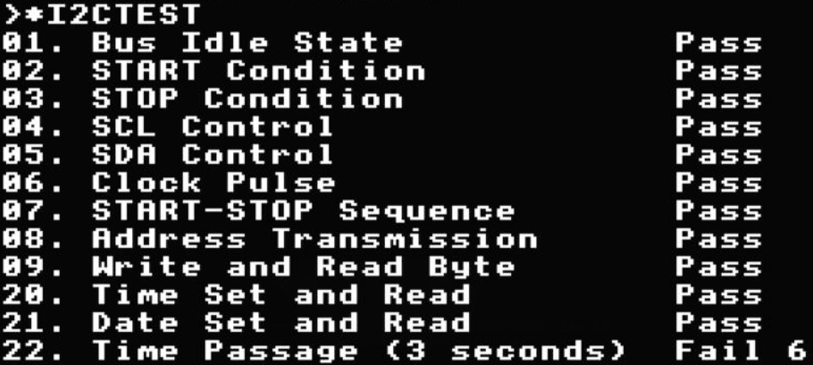

I2CBeeb ROM for BBC, Electron, Electron AP6
===========================================

> **⚠️ IMPORTANT NOTE:** This is an exploration branch only at present. Source files relating to other AP6 supporting ROMs and builds of them will not be merged into the final branch—they are temporarily stored here for ease of exploration.

This project got started as a means to explore and implement RTC commands and others that make use of the RTC (a `PCF8583`) within the Electron **AP6** by Dave Hitchens. StarDot forum discussion [here](https://www.stardot.org.uk/forums/viewtopic.php?t=28720). It has now become a means to build the I2C Rom by MartinB (of StarDot) using the BeebAsm assembler for three targets, **BBC Micro**, **Electron** and **Electron Plus with AP6** (`/bin/build.sh`). Additionally tools in this project will also rebuild the AP6 Support ROM to include the I2C AP6 ROM (`/bin/buildap6/build.sh`) all be it without TreeROM due to size restrictions. All compiled output is in `/dist`.

This repository has partnered with Barney Hilken, the author of the [Time & Config. ROM](https://codeberg.org/Barneyntd/Time-Config.), to reuse its configuration feature implementation. Many thanks to Barney for making this integration possible. The build scripts dynamically pull source code from the Time & Config repository during the build process—the code is not duplicated in this repository. The extraction process is handled by [`/bin/time-config/extract.sh`](bin/time-config/extract.sh), which clones the Time & Config repository, extracts the necessary source files, and applies selective modifications during extraction to support integration (such as removing unsupported features like timezone and summertime configuration). This integration enables `*CONFIGURE` and `*STATUS` commands for machine configuration, as well as `*INSERT` and `*UNPLUG` commands for ROM management. For more information and documentation on Time & Config ROM features, readers should refer to the [Time & Config. repository](https://codeberg.org/Barneyntd/Time-Config.) directly.

The project builds multiple ROM variants for each target platform:

| Filename (/dist) | Filename (.ssd) | Platform | RTC Type | I2C Core | Plus *CONFIGURE | Plus Test |
|------------------|-----------------|----------|----------|----------|------------------|-----------|
| `i2cb.rom` | `I2CB` | BBC Micro* | DS3231 | ✓ | | |
| `i2cbc.rom` | `C.I2CB` | BBC Micro* | DS3231 | ✓ | | |
| `i2cbt.rom` | `T.I2CB` | BBC Micro* | DS3231 | ✓ | | ✓ |
| `i2ce.rom` | `I2CE` | Electron | DS3231 | ✓ | | |
| `i2cec.rom` | `C.I2CE` | Electron | DS3231 | ✓ | | |
| `i2cet.rom` | `T.I2CE` | Electron | DS3231 | ✓ | | ✓ |
| `i2ceap6.rom` | `I2CEAP6` | Electron AP6 | PCF8583 | ✓ | ✓ | |
| `i2ceap6c.rom` | `C.I2CEAP6` | Electron AP6 | PCF8583 | ✓ | ✓ | |
| `i2ceap6t.rom` | `T.I2CEAP6` | Electron AP6 | PCF8583 | ✓ | ✓ | ✓ |
| `ap6.rom` | `AP6` | Electron AP6 Support ROM | PCF8583 | ✓ | ✓ | |

**BBC Micro\*** — the `I2CB` / `C.I2CB` / `T.I2CB` rows are one sideways-ROM profile for **BBC Model B**, **B+**, **Master**, and **Master Compact** (not separate Master builds). The I²C core (`*I2C…`, RTC/time commands, `*I2CTEST`) is expected to work on all of them; bus access is via the **user port**, the same attachment path on Model B and Master-class machines.

**Note (Plus *CONFIGURE*):** `*CONFIGURE`, `*STATUS`, and related Time-Config features appear only in **Electron AP6** builds (tick in that column). They require **NVRAM**; the AP6 **PCF8583** has free RAM for persisted settings. Typical **DS3231** modules on **Model B, B+**, and basic **Electron** have **no user-accessible RAM**. **Master** machines already provide their own persisted configuration—so those commands are omitted from all BBC-family ROMs by design. Detected **EEPROM** devices on the I²C bus could provide NVRAM on other targets in future.

**I²C addresses (7-bit):** BBC Micro* and Electron builds talk to a **DS3231** at **`&68`** (`RTC` in `src/inc/rtc/DS3231.asm`). Electron **AP6** builds (and production AP-class boards with the on-board RTC) use a **PCF8583** at **`&50`** (`RTC` in `src/inc/rtc/PCF8583.asm`) — the same address used in the `*I2CRXB 50 …` examples in [Usage with AP6](#usage-with-ap6) below. Dave’s planned cartridge RTC is expected to stay on **`&50`** so it matches AP6 without a rebuild.

Star commands take the address in **decimal** (`50` = `&50`). On AP6, **`&50` registers `10h`–`11h`** are reserved by this ROM; **`12h`+** holds configure NVRAM. Other devices on the AP6 header must not clash with **`&50`**. Use `*I2CQUERY` / `*I2CTEST` on hardware to confirm.

This project also includes support for building the AP6 Support ROM (`ap6.rom`) which combines the I2C ROM with other AP6 ROMs (AP1Plus, ROMManager, TUBEelk, AP6Count) into a single 16KB ROM image. The build process is handled by [`/bin/buildap6/build.sh`](bin/buildap6/build.sh) and uses SMJoin compatibility to enable ROM relocation and chaining. For detailed technical information about the AP6 Support ROM build process, see the [SMJoin Compatibility Implementation](#smjoin-compatibility-implementation-sept-2025) section below.

**IMPORTANT DISTRIBUTION NOTE**

This repository `/dist` folder contains version **v3.2** and above of the **I2CBeeb** ROM. If you need the official I2CBeeb ROMs **v3.1**, see [thread](https://stardot.org.uk/forums/viewtopic.php?t=10966) for other variants. Looking forward, since this repo supports building all variants of the ROM, one option is this repository may become the main I2CBeeb repository in the future, or it may reside some other place. Currently the source code is only shared by Martin as attachments on StarDot and in this repository per his kind permission.

The Time & Config integration code is dynamically pulled from the [Time & Config. ROM repository](https://codeberg.org/Barneyntd/Time-Config.) during the build process and is not duplicated in this repository. Many thanks to Barney Hilken, the author of the Time & Config. ROM, for making this integration possible. The build scripts (`/bin/time-config/extract.sh`) clone the Time & Config repository, extract the necessary source files, and apply selective modifications (such as removing unsupported features) before inclusion in the ROM builds. For more information and documentation on Time & Config ROM features, readers should refer to the [Time & Config. repository](https://codeberg.org/Barneyntd/Time-Config.) directly. 

Status - Release v3.3 In Progress - Test Framework and Configure Support (Jan 2026)
----------------------------------------------------------------------------------

This release introduces significant enhancements including integration with the Time & Config ROM for configuration management and ROM control features. The `*CONFIGURE` and `*STATUS` commands enable system configuration settings to be stored in NVRAM and applied on boot, while `*INSERT` and `*UNPLUG` commands provide ROM management capabilities. These features are currently available only in Electron AP6 builds due to NVRAM requirements—the PCF8583 RTC chip provides sufficient free RAM for configuration storage, while the DS3231 RTC chip used in BBC Micro* and basic Electron builds has no user-accessible RAM. The build system has been updated to disable configure features for BBC and Electron builds, keeping them enabled only for Electron AP6 builds. Additionally, the `*I2CTEST` command has been implemented to provide comprehensive automated testing of I2C functionality across all target platforms (on real hardware). Automated ROM unit tests run during `./bin/build.sh`; see [ROM unit testing](#rom-unit-testing). For on-machine I2C tests, see the [Test Framework *I2CTEST](#test-framework-i2ctest) section below.

Status - BeebAsm Migration Complete (Sep 2025)
----------------------------------------------

The main source code has been successfully migrated from Lancs Assembler to BeebAsm and is now located in `/src` (original Lancs Source code is for now in `/src.lancs` but will of course not be updated going forward). This migration represents a significant improvement to the development workflow, eliminating the need to run B-em emulator to compile with the Lancs Assembler. The development process is now much faster with native compilation on modern systems, and provides full compatibility with modern editors such as Visual Studio Code and its 6502 tooling extensions.

The migration required careful attention to assembler syntax differences, particularly converting high/low byte operators from Lancs `>/<` syntax to BeebAsm `HI()/LO()` functions, and fixing endianness issues by converting `DFDB` (big-endian) to `EQUB HI(), LO()` format. The result is byte-for-byte compatibility with the original Lancs Assembler ROMs, verified through comprehensive binary comparison testing using both manual `cmp` commands and custom Python comparison tools.

Status - v3.2 Release
---------------------

This adds support for type 0 OSWORD 14 handling to ensure `*TIME` and `PRINT $TIME` on the BBC Master Compact work - when using the I2CB ROM. This is based on the patch shared [here](https://www.stardot.org.uk/forums/viewtopic.php?p=371328#p371328). I have not tested as yet on the Electron or Electon AP6 targets, but plan to, in theory they have not changed since v3.1 behavior as this was a purely additional change... An ssd and each rom in is under `\dist`. Also of note is that `TIME="bla..."` is not supported yet - more fun later (remind to check `\src.softrc`)

Status - AP6 Target Beta
------------------------

Current status is this variant of the **I2CBeeb ROM by MartinB** is working with a reasonble level of testing with an AP6. However it is currently labelled as **Beta**, so please expect some bugs and report on the thread. It can be downloaded from here `/dist/i2c/I2C32EAP6.rom`. See known issues below. 

Usage with AP6
--------------

You need a Plus 1 with the AP6 expansion board fitted and a battery installed for the RTC chip to retain time and data. Download and install/load the ROM above. All the commands, `*TSET, *DSET, *NOW, *DATE, *TIME` etc work as per documentation on Martins [thread](https://stardot.org.uk/forums/viewtopic.php?t=10966). There is one notable exception that the `*TEMP` command outputs `Not Available`, because the PCF8583 RTC does not support this.

What the PCF8583 does have though is storage! Meaning you can do things like this to store information and have it retained. Note that the PCF8583 free ram starts at address `10h`, however the ROM uses `10h` and `11h` locations so please consider these reserved, anything above `12h` is fine! Note that, `50` used in the commands below is the device ID for the installed PCF8583.

    *I2CQUERY
    *I2CRXB 50 #12 A%
    *I2CRXB 50 #02 A%
    *I2CTXB 50 #12 66

    $&A00="HELLO"
    *I2CTXD 50 #12 06
    *I2CRXD 50 #12 06
    P.$&A00

Finally, note that the AP6, has I2C headers on board, meaning you can attach easily other I2C devices and access them using the above commands. Please be careful attaching new devices and observe the correct pin out, then run `*I2CQUERY`.

COLD — simulated power-on reset (Electron AP6 dev)
-------------------------------------------------

Testing `*CONFIGURE LANG` (and other NVRAM settings applied on boot) needs a **true power-on** (`&028D = 1`). Ctrl+Break and `JMP (&FFFC)` do not reload configure from NVRAM—they are soft or hard breaks, not cold start.

The **`COLD`** utility fakes a power-on reset in software so you can repeat configure tests without mains off/on. It is based on [hoglet’s assembler recipe](https://stardot.org.uk/forums/viewtopic.php?t=20240) on Stardot (same thread as JGH’s `.ResetElk` variant, which uses `&FFFC + 25` instead of a fixed jump).

**Source:** [`src/utils/COLD.asm`](src/utils/COLD.asm) — hoglet’s `.power_up_reset` routine, assembled at `&0B00`.

**Build integration:** At the end of [`src/I2CBeeb.asm`](src/I2CBeeb.asm), after `SAVE romstart, romend`, BeebAsm `INCLUDE`s `COLD.asm` and `SAVE`s a separate DFS executable onto each build SSD (`SAVE "COLD", &0B00, *`). This does **not** modify the sideways ROM image (`I2CEAP6`, `dist/ap6.rom`, etc.)—only adds a disc file alongside the ROM and other `PUTBASIC` utilities. `./bin/build.sh` extracts it from the AP6 SSD into `src/out/ap6/` and copies [`dev/eap6/COLD`](dev/eap6/COLD) (+ `.inf`) for hardware, UPURSFS, or b-em.

**Usage** (with `COLD` on the default DFS drive):

    *CONFIGURE LANG 5
    *STATUS LANG
    *COLD

Or `*RUN COLD`. Load and exec are both `&0B00` (see `dev/eap6/COLD.inf`).

After reboot, check power-on path and session LANG:

    PRINT ~?&028D    : REM expect 1 (power-on)
    PRINT ~?&0D6D    : REM LANG in low nibble after GetTubeAndLang

**Caveats:** Electron **MOS 1.00** only—the `JMP &D8EB` target is hard-coded for that revision. Other MOS versions need a different entry (JGH’s `RESET + 25` via `&FFFC` may suit some boards better). This is not a hardware reset: sideways ROM and ULA state may differ from mains off/on. For final verification, power-cycle the machine.

Building
--------

Build with `./bin/build.sh` and this will compile using BeebAsm all three targets for BBC Micro, Acorn Electron and Acorn Electron Plus 1 AP6 in `/dist`. It will also update `/dev/eap6` and `/dev/roms`; these folders work with virtual file systems such as the one in b-em and are supported by UPURSFS, so build output can be loaded and tested on a target machine. The `dev/eap6` folder also receives dev utilities from the AP6 build SSD: `COLD` (6502 executable from `COLD.asm`) and tokenised BASIC files `NVList`, `RTCTest`, and `RTCRead` (via `PUTBASIC`). See [COLD](#cold--simulated-power-on-reset-electron-ap6-dev).

Unless you pass `--skip-testing`, the build also runs the automated ROM unit tests described below.

ROM workspace (memory used)
------------------------------

Fixed RAM the ROM uses for storage (see [`src/I2CBeeb.asm`](src/I2CBeeb.asm)). MOS star-command scratch at `&A8–&AF` may be overwritten during any `*` command; do not rely on it across `OSCLI`. The ROM does not use `&0234–&0235` (`INDV3`).

| Range | Role |
|-------|------|
| `&A8–&AF` | Star-command scratch — parser temps, command table pointer, I²C flags during `*` handlers |
| `&02E0–&02EA` | I²C transaction state (device address, register, byte count, status, EEPROM helpers) |
| `&0380–&0392` | RTC time/date scratch (`buf00`–`buf06`, `buf12` ToB, temp bytes on DS3231) |
| `&0A00–&0AFF` | I²C Tx/Rx buffer and `*NOW$` output |
| `&E4–&E5` | Configure builds only — Time-Config string pointer (`STR_PrintString`) |

Persistent settings on AP6 are stored in **NVRAM on the board** (PCF8583/FRAM), not in these RAM areas.

ROM unit testing
----------------

Each `./bin/build.sh` run (unless `--skip-testing` is passed) exercises the **real assembled ROM binaries** against a simulated 6502, with MOS calls stubbed out so tests can run quickly on a modern machine without a Beeb attached. This is separate from the on-machine `*I2CTEST` command documented [further down](#test-framework-i2ctest)—those tests need hardware and an I2C bus.

The tests are mainly about **sideways-ROM good manners**: behaving correctly when the MOS hands you a `*` command, and not trampling memory the rest of the system expects to keep.

**What we check (ROM conventions and expectations)**

- **Star-command dispatch** — unknown `*` commands are handled through the normal service entry; handlers are reached without repurposing the language indirection vector at `&0234` (`INDV3`).
- **Zero-page workspace** — MOS star-command scratch at `&A8–&AF` may be used freely during a `*` handler (the same convention used by ROMs such as JGH’s ROM Manager). The rest of zero page should be left alone across a command. Configure builds may also use `&E4–&E5` for Time-Config string output.
- **`*HELP`** — title and extended help output follow Acorn-style expectations (including not adding an extra blank line before the banner on global `*HELP`).
- **Time and date commands** — `*TIME`, `*DATE`, `*NOW`, and related paths produce sensible output when the RTC is mocked.
- **Time-on-Break (`*TBRK`) and boot (service 1)** — toggle and boot-header behaviour against a mocked RTC.
- **Configure builds (Electron AP6)** — `*CONFIGURE` and `*STATUS` read and write NVRAM as expected; dot-abbreviated command forms work; bad parameters are rejected without corrupting stored settings.

**Coverage (high level)**

Tests run against the main configure-less ROM variants built into `/dist` (BBC, Electron, and Electron AP6). Configure-specific cases run on the AP6 configure build. They validate ROM logic and MOS integration, **not** real I2C electrical behaviour—that remains the job of `*I2CTEST` on real hardware.

**Where the tests live**

| Location | Purpose |
|----------|---------|
| [`src/tests/vitest/`](src/tests/vitest/) | Test cases — `standalone/`, `configure/`, `fixtures/ap6/`, `fixtures/ap6-classic/` (see **`src/tests/vitest/README.md`**) |
| [`bin/rom-unittest/`](bin/rom-unittest/) | Test harness, MOS/RTC/NVRAM mocks, workspace guards |

To run the unit tests on their own after a build:

    cd bin/rom-unittest && npm test

`./bin/build.sh` runs standalone Vitest, then `./bin/buildap6/build.sh` for the i2c layout (composite Vitest on **`dist/ap6.rom`**) and builds **`bin/buildap6/out/ap6-classic.rom`** (test fixture, not shipped in **`dist/`**), then runs **`npm run test:classic-only`** (7 LANG/TUBE tests). See **`bin/rom-unittest/README.md`**.

Some Year Testing
-----------------

The year logic is funky! Meaning there is software workarounds to the fact the PCF8583 only stores 2 bit years, max 4 years basically. So some shadow year and offset values are also stored to get to the year value. There is some management of these each time the date/time is read. As I did not want to wait for years to pass to complete my test some poking is required to emulate the conditions the code applies to.

**Note:** These tests actually require the validation logic *I2CTXB commenting out (the `JSR txbval` and `BCS txbpx` in `txbparse`) as the I2CRXB normally does not allow the reserved storage to be written.

**Test 1** - Last year sync properly with the current year (*TBRK off)

    Step 1
    *DSET Mon 01-01-20
    *NOW
    Assert &A10=32 (offset)
    Assert &A11=0  (last year and boot toggle)

    Step 2
    *DSET Mon 01-01-22
    *NOW
    Assert &A10=32  (offset)
    Assert &A11=128 (last year and boot toggle)

    Step 3 - This emulates the machine not having been powered up since 2020
    A%=0
    *I2CTXB 50 #11 A%
    A%=42
    *I2CRXB 50 #11 A%
    Assert A%=0

    Step 4
    *NOW
    Assert: Year is still 22
    Assert: &A11=128

    Step 5
    A%=42
    *I2CRXB 50 #11 A%
    Assert A%=128

**Test 2** - Last year sync properly with the current year (*TBRK on)

    Step 1
    *DSET Mon 01-01-20
    *NOW
    Assert &A10=32 (offset)
    Assert &A11=1  (last year and boot toggle)

    Step 2
    *DSET Mon 01-01-22
    *NOW
    Assert &A10=32  (offset)
    Assert &A11=129 (last year and boot toggle)

    Step 3 - This emulates the machine not having been powered up since 2020
    A%=1
    *I2CTXB 50 #11 A%
    A%=42
    *I2CRXB 50 #11 A%
    Assert A%=1

    Step 4
    *NOW
    Assert: Year is still 22
    Assert: &A11=129

    Step 5
    A%=42
    *I2CRXB 50 #11 A%
    Assert A%=129

**Test 3** - Check it adjusts for wrap around of year in RTC (*TBRK off)

    Step 1
    *DSET Mon 01-01-22
    *NOW
    Assert &A10=32  (offset)
    Assert &A11=128 (last year and boot toggle)

    Step 2
    *DSET Mon 01-01-25
    *NOW
    Assert &A10=36  (offset)
    Assert &A11=64  (last year and boot toggle)

    Step 3 - This emulates the machine not having been powered up since 2022
    A%=32
    *I2CTXB 50 #10 A%
    A%=42
    *I2CRXB 50 #10 A%
    Assert A%=10
    A%=128
    *I2CTXB 50 #11 A%
    A%=42
    *I2CRXB 50 #11 A%
    Assert A%=128

    Step 4
    *NOW
    Assert year is 25
    Assert &A10=36
    Assert &A11=64

Where did the Source code come from?
------------------------------------

In the **StarDot** thread linked above, MartinB the author of the **I2C Beeb ROM** shared his code in order to help create a compatible version for the Acorn Electron AP6. Rather than create fork of his code just for AP6 I decided to explore if AP6 support can be added and thus support future updates.

Initially my aim was just changing the required parts of the code. This was quite easy as Martin had done an amazing job at separating out the code needed to access the I2C bus and read/write to the RTC from all the other logic. With a little use of the `INCLUDE` directive in the Lancs Compiler it was possible to have a single source file for the bulk of the code in `/src.lancs/I2CBeeb.asm` with the differences needed to support different targets in `/src.lancs/inc` per above. This means that should the main code be updated, we can easily rebuild all three targets from it, much like how the variants of **MMFS** work.

Martin has given kind permission in the **StarDot** thread above to leverage his code to make all this possible and hopefully making iterating on the ROM for all targets possible in the future (though right now there are no plans beyond adding support for AP6, as its kinda pretty good as-is tbh). Since then as noted above the `/src` now contains a migration of his original code that now supports the BeebAsm tool, which speeds up the compilation dramatically and removes the need for an emulator.

SMJoin Compatibility Implementation (Sept 2025)
------------------------------------------------

**I2C ROM Successfully Integrated into Combined AP6 ROM System ✅**

Successfully implemented SMJoin compatibility for the I2C ROM, enabling it to be combined with other AP6 ROMs into a single 16KB ROM image. For detailed technical information about the ROM relocation and chaining mechanisms, see [smjoin.md](/bin/buildap6/smjoin.md).

**Key Achievements:**
- **5 ROMs successfully combined**: AP1v131, AP6v134, TUBEelk, AP6Count, I2C
- **Total size**: 12.8KB (well under 16KB limit with 3.5KB free space)
- **SMJoin compatibility**: Proper relocation data generation and ROM header format
- **Automated build and test pipeline**: Complete workflow from I2C compilation to ROM testing

**Technical Implementation:**
- **Dual compilation process**: Compile ROM at $8000 and $8100 to generate relocation data
- **Node.js relocation tool**: `smjoin-reloc.js` compares builds and generates compressed relocation bitmap
- **Header modification simulation**: Sets header bytes first, then generates bitmap accounting for new candidate bytes
- **Service entry adjustment**: Automatically adjusts addresses for relocation from $8000 to $8100

**Build Tools:**
- `bin/buildap6.sh` - Unified build pipeline script with testing flags
- `bin/buildap6/smjoin-build-i2c-rom.sh` - Builds I2C ROM at both $8000 and $8100
- `bin/buildap6/smjoin-reloc.js` - Node.js tool for relocation data generation
- `bin/buildap6/smjoin-create.js` - Node.js port of BBC BASIC SMJoin tool
- `bin/buildap6/smjoin-test.js` - Playwright-based ROM testing with emulator automation
- `dist/ap6.rom` - Final combined ROM output

**Documentation:**
- `SMJOIN.md` - Comprehensive documentation of ROM relocation and chaining mechanisms
- Detailed explanation of candidate bytes, relocation bitmap generation, and header modification
- Step-by-step instructions for both BBC BASIC and non-BBC BASIC ROMs
- Complete example of relocation bitmap generation process

**Validation:**
- All 5 ROM tests pass: AP6.rom, LatestAP6.rom, I2C.rom, LatestI2C8000.rom
- I2C ROM correctly relocates service address and integrates with AP6 Plus
- Relocation data generation is stable and reproducible
- ROM header format matches SMJoin requirements
- Emulator testing confirms "RH Plus 1" display in combined ROM

**Result:** The I2C ROM is now fully compatible with the SMJoin system and can be combined with other AP6 ROMs into a single 16KB ROM image, providing a complete AP6 ROM solution with automated testing.

TreeROM Version Compatibility Issue (Sep 2025)
-----------------------------------------------

**Issue Identified: TreeROM Version Mismatch Preventing Full ROM Combination**

During testing of the complete AP6 ROM combination (including TreeROM), a version compatibility issue was discovered that prevents the full 5-ROM combination from fitting within the 16KB limit.

**Problem Analysis:**
- **Current TreeROM available**: Version 1.62 (8,704 bytes) - too large for 16KB ROM
- **Original AP6v134t.rom used**: TreeCopy Version 1.61 (8,291 bytes) - fits successfully
- **Available space**: 8,448 bytes (after combining AP1v131, AP6v134, TUBEelk, AP6Count, I2C)
- **Space deficit**: 256 bytes (8,704 - 8,448 = 256 bytes)

**Critical Discovery:**
The original AP6v133t.rom (16,067 bytes) contained **5 ROMs without I2C**:
- AP1v131, AP6v133, TUBEelk, AP6Count, TreeROM
- **No I2C ROM was included in the original combination**

Our current build includes **4 ROMs plus I2C** (12,887 bytes), which leaves 8,448 bytes available for additional ROMs.

**Detailed Size Analysis:**
- **TreeCopy 1.61** (original): 8,291 bytes ✅
- **TreeROM v1.62** (available): 8,704 bytes ❌ (256 bytes too large)
- **Available space**: 8,448 bytes
- **Size difference**: TreeROM v1.62 is 413 bytes larger than TreeCopy 1.61
- **Conclusion**: The 16KB ROM space can accommodate either the original 5 ROMs OR 4 ROMs + I2C, but not all 6 ROMs together

**Root Cause:**
The source code analysis at [MDFS TreeCopier](https://mdfs.net/Software/CommandSrc/FileUtils/TreeCopier/) confirms that TreeCopy version 1.62 source is larger than version 1.61, explaining the size difference. The original AP6v133t.rom was built using the smaller TreeROM version 1.61.

**Current Status:**
- ✅ **4-ROM combination works perfectly**: AP1v131, AP6v134, TUBEelk, AP6Count, I2C (12,887 bytes)
- ❌ **5-ROM combination fails**: Adding TreeROM 1.62 exceeds 16KB limit by 256 bytes
- ✅ **All tests pass**: Complete build and test pipeline functional without TreeROM
- ✅ **Binary analysis confirmed**: AP6v134t.rom contains TreeCopy 1.61 (8,291 bytes), not 1.62

**Reference:** [MDFS TreeCopier Source](https://mdfs.net/Software/CommandSrc/FileUtils/TreeCopier/) - Contains source code for both TreeCopy 1.61 and 1.62 versions.

Merging I2C ROM into the AP6 Main ROM Update (Jan 2025)
-------------------------------------------------------

I have been reviewing the orignal build scripts to merge 4 ROMs into 1 and have got them running via b-em emulator and its co-processor emmulation (previously looks like the scripts ran on an A5000). The src.AP* folders contain files I have been downloading to get to the point where I can reproduce the current merged ROM from the existing ROM images. This will prove I have the build tools/scripts working. There is however a difference I am exploring with Dave Hitchens at present. Once this is resolved I can apply the realloc table to the I2C ROM and merge it in as well (its about 4kb and we have 8kb spare!). Oh and I also spent a chunk of time getting b-em building on my Macbook running Silcon hardware - build in in /bin/b-em.

Known Issues
------------
- None at present

Other (Useful) Stuff
--------------------

Various reference resources, forum posts etc..
- [Read RTC Clock - OSWORD 14](https://beebwiki.mdfs.net/OSWORD_%260E)
- [Write RTC Clock - OSWORD 15](https://beebwiki.mdfs.net/OSWORD_%260F)
- [Real time clock upgrade for Electron](https://www.stardot.org.uk/forums/viewtopic.php?p=419371&hilit=RTC#p419371)
- [OSWORD 14 & 15 numbers for real-time clocks](https://www.stardot.org.uk/forums/viewtopic.php?t=28743)
- [Userport RTC](https://stardot.org.uk/forums/viewtopic.php?f=3&t=26270)
- [Setting a real-time clock to centi-second accuracy](https://www.stardot.org.uk/forums/viewtopic.php?p=419313#p419313)
- [Handling year in the RTC](https://github.com/xoseperez/pcf8583/blob/master/src/PCF8583.cpp)
- [Handling year in the RTC another example](https://github.com/xoseperez/pcf8583/blob/master/src/PCF8583.cpp#L162)
- [Handling year in the RTC yet another example](https://github.com/pciebiera/rtc-philips-pcf8583/blob/master/rtc-philips-pcf8583.c )
- [ROM joining approach](https://mdfs.net/Info/Comp/BBC/SROMs/JoinROM.htm)
- [Interesting base code for ROMS](https://mdfs.net/Software/BBC/SROM/Tools/MiniROM.src)
- [Source code AP6Count useful ref](https://mdfs.net/Software/BBC/SROM/AP6Count.bas)
- [Source code AP6 Plus 1 ROM](https://mdfs.net/Software/BBC/SROM/Plus1/)

Test Framework *I2CTEST
------------------------

The I2C ROM includes a comprehensive test framework accessible via the `*I2CTEST` command.

This framework provides automated testing of I2C bus functionality, low-level I2C operations, and RTC (Real-Time Clock) operations. The test framework runs a series of tests and reports results, showing "Pass" or "Fail" for each test with step numbers for detailed failure reporting. **All tests require actual hardware and cannot be run in emulation** - some tests focus on low-level I2C bus operations, while others require an RTC device (DS3231 or PCF8583) connected to the I2C bus.

**Important:** The `*I2CTEST` command is only available in the test builds of the ROMs. Production ROMs exclude this command to conserve space. Test ROMs are available both as individual ROM files in `/dist` (e.g., `i2cbt.rom`, `i2ce.rom`, `i2ceap6t.rom`) and on the SSD disc image `i2c.ssd` in DFS format (e.g., `T.I2CB`, `T.I2CE`, `T.I2CEAP6`).

To run the tests, simply load a test ROM and execute:

    *I2CTEST

The test framework will run all registered tests and display results for each one.

**Test Suite:**

| Test | What It Tests |
|------|---------------|
| 01. Bus Idle State | Verifies I2C bus is in idle state (SDA high) |
| 02. START Condition | Verifies START condition sets SDA low |
| 03. STOP Condition | Verifies STOP condition returns SDA to idle (high) |
| 04. SCL Control | Verifies SCL line control (indirectly via clock pulse) |
| 05. SDA Control | Verifies SDA line can be set high and low |
| 06. Clock Pulse | Verifies clock pulse generation (sclhi then scllo) |
| 07. START-STOP Sequence | Verifies complete START-STOP sequence |
| 08. Address Transmission | Verifies 7-bit address transmission with ACK/NACK handling |
| 09. Write and Read Byte | Verifies byte write and read operations to RTC |
| 20. Time Set and Read | Verifies time values can be written and read from RTC |
| 21. Date Set and Read | Verifies date values can be written and read from RTC |
| 22. Time Passage (3 seconds) | Verifies RTC time advances correctly over time |
